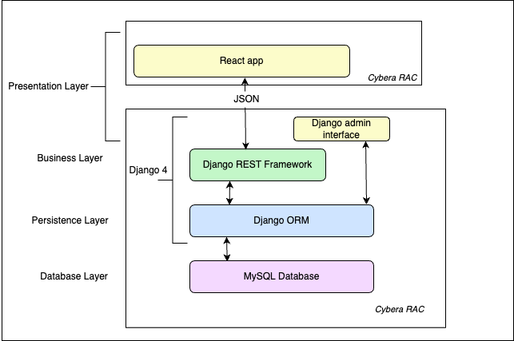

# Software Design

## Architecture Diagram
This is a short description of the architecture.

## UML Class Diagram
This is a short description of logical entities of the domain in a UML diagram.

## Sequence Diagrams
Multiple sequence diagrams depicting the most important scenarios.

### Admin Sequence

### User Sequence

