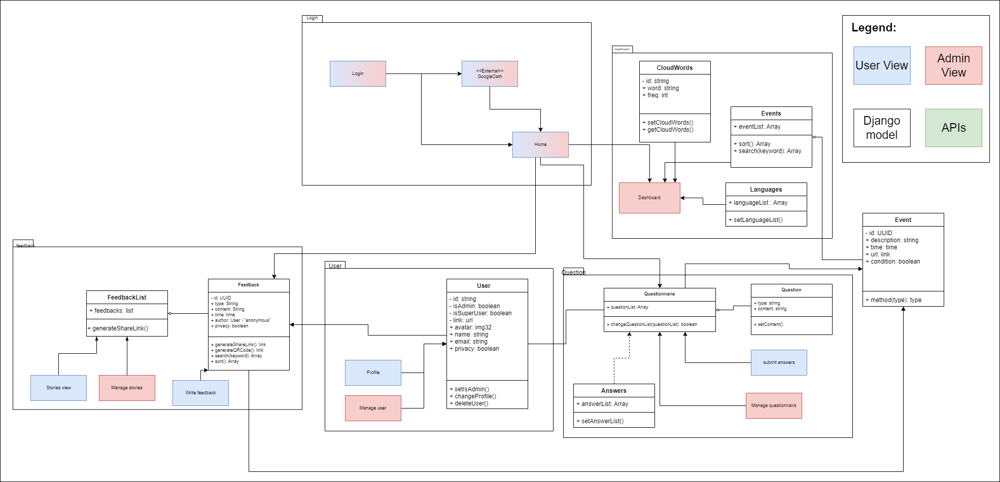

# Software Design
This page includes a short description of the overall architecture style of the system, its high-level system components, and their logical (what data they exchange) and control (how they invoke each other) dependencies.

## Architecture Diagram
This is a short description of the architecture.

## UML Class Diagram
This is a short description of logical entities of the domain in a UML diagram.

## Sequence Diagrams
Multiple sequence diagrams depicting the most important scenarios.

### Admin Sequence

### User Sequence

## Low-Fidelity User interface
At this stage, it’s important to show the overall look and feel of your app, as well as the high-level user-interaction design. Low-fidelity wireframes are usually black and white. Looking at the wireframes, anyone should be able to get an idea of what will be developed.

