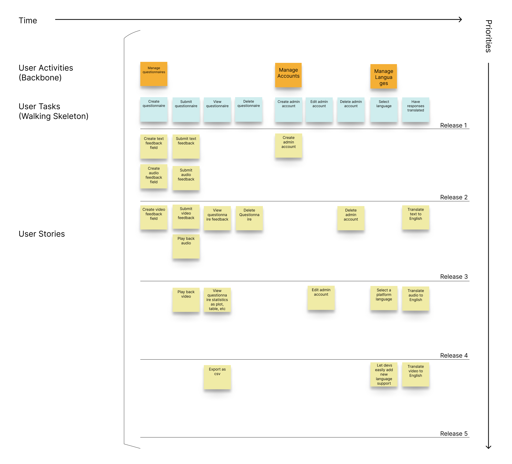

# Project Management
This page provides a general overview of the assigned tasks and roles for the duration of five sprints (subject to change).

## Story Map

## Project Plan

### Sprint 1

Due September 24

#### Tasks

| **Task** | **Related US** | **Assigned To** | **Due Date** |
| --- | --- | --- | --- |
| Project requirements | Project documentation | Jason, Théo, Mohammed, Asad| Sep 20 |
| Software design | Project documentation | Jason, Théo, Asad, Mohammed, Favour, Jinglong | Sep 21 |
| Project management | Project documentation | Jason, Théo, Asad, Mohammed, Favour, Jinglong | Sep 22 |
| Teamwork | Project documentation | Jason, Théo, Asad, Mohammed, Favour, Jinglong | Sep 19 |
| Deploy docs | Project documentation | Jinglong | Sep 24 |

### Sprint 2

Due October 15

#### **User stories**

| **User Story** | **Story Points** |
| --- | --- |
| SETUP - Setting up dev environment | 3 |
| US 1.01 | 3 |
| US 1.02 | 8 |
| US 3.01 | 1 |

Estimated sprint velocity: **15**

**Tasks**

| **Task** | **Related US** | **Assigned To** | **Due Date** |
| --- | --- | --- | --- |
| MySQL database setup | SETUP | Asad | Oct 10 |
| Django models | SETUP | Jinglong | Oct 7 |
| React app | SETUP | Jason | Oct 5 |
| User authentication | US 1.01 | Mohammed | Oct 8 |
| JSX/CSS for login | US 1.01 | Mohammed | Oct 11 |
| Dashboard JSX/CSS | US 1.01 | Théo | Oct 12 |
| JSX for creating questionnaires | US 1.02 | Favour | Oct 13 |
| CSS for creating questionnaires | US 1.02 | Jason | Oct 14 |
| REST API endpoints for creating questionnaires | US 1.02 | Théo | Oct 14 |
| Text feedback | US 3.01 | Jinglong | Oct 15 |

## Sprint 3

Due October 29

**User stories**

| **User story** | **Story points** |
| --- | --- |
| | |

Estimated sprint velocity: ...

**Tasks**

| **Task** | **Related US** | **Assigned To** | **Due Date** |
| --- | --- | --- | --- |
| | | | |

## Sprint 4

Due November 19

**User stories**

| **User story** | **Story points** |
| --- | --- |
| | |

Estimated sprint velocity: ...

**Tasks**

| **Task** | **Related US** | **Assigned To** | **Due Date** |
| --- | --- | --- | --- |
| | | | |

## Sprint 5

Due December 3

**User stories**

| **User story** | **Story points** |
| --- | --- |
| | |

Estimated sprint velocity: ...

**Tasks**

| **Task** | **Related US** | **Assigned To** | **Due Date** |
| --- | --- | --- | --- |
| | | | |
